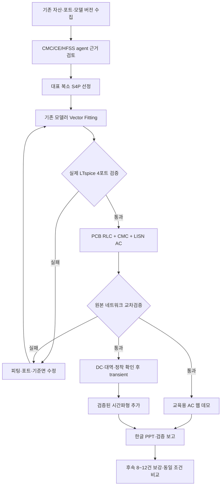

# CMC → SPICE → PCB/LISN 교육용 웹 데모 실행 계획

작성: 2026-09-09. 이번 산출물은 계획이며 새 해석·배포·Claude API 호출을 실행했다는 의미가 아니다.

## 1. 목표와 우선순위

현재 80건/150 kHz~30 MHz surrogate와 기존 HFSS·PCB·LISN 산출물로, 필터 적용 전후를 설명하는 교육·마케팅용 웹 데모를 먼저 만든다. 전체 200 MHz/128건 학습은 선행 조건에서 제외한다. 진행 중인 고주파 해석의 상태는 실행 전 재확인하고, 이미 얻은 결과는 대표 설계 진단에만 재사용한다. 계획 작성 단계에서 실행 중인 작업을 임의로 중단하지 않는다.

1. 대표 CMC 원본 S4P → 기존 변환 앱 → 실제 LTspice 재현 검증.
2. 검증된 CMC SPICE → 기존 PCB RLC + X/Y capacitor + LISN 결합.
3. 대표 설계의 사전 계산 결과를 홈페이지에 제공.
4. 여유 단계에서 8~12개 학습점만 보강하고 기존 모델과 동일한 조건으로 비교.

자유 입력 surrogate의 |ZCM|/|ZDM| 예측과 대표 설계의 복소 4포트 SPICE를 구분한다. 크기 곡선만으로 위상·모드 변환을 임의 생성하지 않는다. 자유 입력값에 해당하는 검증된 SPICE가 없으면 해당 회로 계산을 비활성화하고 대표 설계 선택으로 안내한다.

## 2. 확인된 재사용 자산과 한계

| 자산 | 확인 경로 | 재사용 및 한계 |
|---|---|---|
| PCB 형상·포트 | `emi_filter_demo.kicad_pcb`, `config.py` PORT_SETS | 첨부 그림의 J1/J2, CX1/CX2, CY1/CY2, L1과 대응하는 데이터. PCB 슬롯 유무와 케이스를 파일 기준으로 확인 |
| HFSS PCB 14포트 | `data/touchstone/caseB2.s14p`, `caseC2.s14p` 및 copper/boundary 변형 | 부품 패드 포함, PE 공통 기준. 홈페이지의 2/4포트 변환기에 14포트를 직접 넣지 않음 |
| PCB RLC 축약 | `src/pcb_lumped.py`, `reports/pcb_B2.lib` | 기존 loop-RL/용량 추출 재사용. PEC 저항 floor와 무시한 상호성분을 명시. 구리 변형과 원본을 혼용하지 않음 |
| 회로 생성·LISN | `src/netlist.py`, `config.py`, `reports/caseB2.cir` | L/N 각각 50 µH, 0.1 µF, 50 Ω의 기존 간략 LISN. 전체 규격 장비 인증 모델로 표현하지 않음 |
| 기존 AC 교차비교 | `reports/ltspice_vs_python.txt` | 기록상 LTspice–Python RLC 최대 0.17 dB, 원본 S 기반 대비 최대 1.14 dB. 이번 대표 설계·연결에서 다시 확인해야 함 |
| 기존 transient | `src/cmc_pcb_transient.py`, `reports/cmc/pcb_transient_settling_KR.md` | 40 ms에서 마지막 주기 차이 약 0.9%. 단일점 CMC 근사·PCB 용량 생략 조건이며 새로운 광대역 모델 검증이 아님 |
| 회로·GUI 연결 | `mvp/cmc_surrogate_gui.py`, `src/cmc_pcb_comparison.py`, `src/cmc_virtual_ce.py` | CM/DM AC, 가상 고조파 RMS, 레이아웃 표시 코드 재사용. QP/AVG 수신기 검파와 구분 |
| 현재 surrogate | `mvp/cmc_curve_surrogate_80.pkl`, `mvp/model_card_80.json` | GPR+PCA8, 30 MHz까지 크기 곡선. 원본 S4P 대신 쓸 수 있는 완전한 복소 네트워크는 아님 |
| S4P→SPICE 앱 | `repos/emxai-homepage/services/sparam-modeler` | FastAPI, Vector Fitting, 안정성/수동성 검사, mixed-mode 표시, SPICE export 구현. 실제 LTspice/ngspice 재해석은 추가 필요 |
| 홈페이지 연결 | `repos/emxai-homepage/src/data/updates-content.ts` | Cloud Run 모델러 링크 존재. 실제 배포 버전·동작은 구현 단계에서 확인 |

이전 `reports/ltspice_vs_python.txt`의 시간파형 RMS 차이는 큰 상태다. 이후 정착 개선 기록과 분석 조건이 다르므로 어느 한쪽을 전체 시간영역 정확도 증거로 사용하지 않는다. 이 계획의 새 검증 데이터셋으로 대체한다.

## 3. 포트와 연결 계약

PCB 포트: p1/p2=LISN 측 L/N, p3/p4=EUT 측 L/N, p5/p6=CX1, p7/p8=CX2, p9/p10=CY1/CY2의 선로측, p11→p12=L 권선, p13→p14=N 권선. 공통 기준은 PE(node 0).

HFSS CMC의 문서상 포트 1=W1 start, 2=W1 end, 3=W2 start, 4=W2 end이므로 1→p11, 2→p12, 3→p13, 4→p14를 후보 매핑으로 둔다. 실제 S4P 헤더, 권선 방향, 생성된 `.SUBCKT` 핀 순서로 재확인 후 고정한다. 기존 간략 CMC 서브회로의 핀 순서를 그대로 복사하지 않는다.

- mixed-mode 입력 쌍은 (1,3), 출력 쌍은 (2,4)를 후보로 확인한다. 앱의 split/adjacent 의미를 코드로 대조한다.
- reference impedance와 PE 기준면, fixture ground 효과를 검토한다. CMC 독립 fixture와 PCB의 기생 성분을 중복 계산하지 않는다.
- CMC CM/DM 전류 정규화와 factor-of-two를 명시한다. 순수 CM/DM 입력으로 극성 검사를 수행한다.
- 기본 비교는 **CMC만 bypass한 회로 vs CMC 적용 회로**이며 X/Y capacitor·PCB·LISN·소스는 동일하다. 완전 무필터 비교는 별도 이름으로 제공한다.

## 4. 단계별 실행과 통과 조건

### A. 대표 설계 1건 변환 검증 (먼저 수행, 잠정 2~4시간)

1. 현재 GUI 기본 설계와 대응하는 원본 복소 S4P, 유효 입력값, 해석 설정, 데이터 해시를 찾는다. 학습 데이터의 요청/자동보정 형상 불일치를 표시한다.
2. 기존 모델러를 로컬 라이브러리로 호출해 pole 후보·안정성·수동성·피팅 오류·SPICE를 저장한다. 원자료의 원격 업로드 없이 시작한다.
3. 출력 핀/기준 노드와 LTspice 구문을 확인한다. 포트별 독립 여기로 전체 4×4 네트워크를 재구성하고 원본/피팅/LTspice를 비교한다.
4. S 오차뿐 아니라 ZCM/ZDM, 전달특성, 공진 위치, 위상도 검증한다. 작은 S 평균 RMS만 좋고 modal Z가 틀리는 모델은 채택하지 않는다.

잠정 선별 목표: CE 대역 modal |Z| 차이 5% 이내, 의미 있는 전달성분 0.5 dB/5° 이내. 영점 근처에는 상대오차 대신 명시한 절대오차 바닥값을 적용한다. pole 안정성과 수동성 검사를 별도로 통과해야 한다. 달성 여부를 보고하고 기준을 조용히 완화하지 않는다. surrogate 일반화 오차와 SPICE 변환 오차는 별도 표로 둔다.

### B. PCB + CMC + LISN AC 통합 (잠정 2~4시간)

기존 B2 PCB RLC를 고정해 먼저 연결한다. PCB 14포트의 Vector Fitting 실패 이력이 있으므로 초기 MVP에서 이 경로를 다시 만들지 않는다. 현재 2/4포트 서비스의 지원 범위를 14포트로 무리하게 확장하지 않는다.

순수 CM → 순수 DM → 위상을 포함한 combined 소스 순으로 계산한다. 전류·전압 기준과 선로별 LISN 출력은 manifest에 저장한다. 원본 HFSS S 기반 Python 노달 계산과 LTspice 네트워크를 같은 부품/소스로 비교한다. 잠정 전체 연결 오차 목표 1.5 dB 이내; 기존 PCB 축약 오차를 포함해 원인별로 분해한다.

### C. 시간파형·가상 CE 스펙트럼 (AC 통과 후, 잠정 2~6시간)

기존 가상 입력 예제(100 kHz, 400 V, 50 ns 등)를 명시한 교육용 설정으로 재사용한다. 대역 밖 응답과 DC 보완 방식을 정의하고, 저주파 R/L 및 수동·안정 extrapolation을 검토한다. 모델은 150 kHz부터 시작하므로 DC 신뢰성을 자동으로 주장하지 않는다.

시간간격 절반 비교, 다중 주기 정착, 적분법 민감도, 동일 대역으로 제한한 주파수-domain 재구성을 비교한다. PCB 용량 생략 등 토폴로지 차이가 있으면 서로 독립 검증이라고 부르지 않는다. 잠정 정착 차이 1%, timestep 변경에 따른 대역제한 RMS/스펙트럼 차이 2%를 선별 기준으로 사용한다.

30 MHz 이하 비교를 먼저 제공한다. 시간파형 정확도가 부족하면 해당 탭은 검증 대기로 두고 AC 데모를 먼저 완성한다. 기존 고주파 데이터가 있는 대표 설계만 확장 피팅을 검토하며, 80개 전체 고주파 재학습을 요구하지 않는다. 고조파 RMS dBµV는 QP/AVG 또는 표준 수신기 측정값이 아니다.

### D. 홈페이지 교육 페이지 (A/B와 병행, 잠정 4~8시간)

권장 초기 화면: 좌측 실제 입력 기반 CMC 형상, 우측 특성·SPICE 피팅 비교. 하단 탭은 PCB 레이아웃/회로도, CMC 전후 CM/DM·LISN 스펙트럼, 검증된 시간파형, 모델 정보/교육 해설.

초기는 대표 설계 1건으로 end-to-end 검증하고 3건으로 확대한다. 사전 계산된 JSON/곡선/SPICE 파일을 웹에서 제공해 방문자마다 HFSS나 로컬 LTspice를 호출하지 않는다. 임의 사용자 netlist 업로드·서버 실행은 MVP 범위에서 제외한다. 기존 Cloud Run 모델러는 변환 도구로 연결하며 라이브 계산은 후속 단계다.

Next.js와 FastAPI 서비스의 현재 배포 구조를 유지한다. UI 코드 수정 전 저장소 AGENTS.md 및 설치된 Next 문서를 확인한다. 공개 전 사전 계산 파일의 포트·단위·버전·유효 대역과 다운로드 파일을 점검한다. 사용자 승인 전 배포/공개하지 않는다.

### E. 8~12건 정확도 보강 (통합 데모 이후, 잠정 3~8시간 + 실제 HFSS 시간)

기존 80건 개발군의 out-of-fold 오차·FSV·공간 빈 곳을 기준으로 추가점을 선택한다. 예: 8건은 고오차 주변 4+공간 보강 4, 12건은 6+6. 제조편차를 새 변수로 추가하지 않는다. 독립 검증군 응답은 선정·튜닝에서 제외하고 기존 holdout이 AL에 사용된 이력을 보고한다.

피치 자동보정 사전검사 후 30 MHz 학습만 수행한다. GPR/PCA와 트리 모델을 같은 split·fold 내부 PCA/정규화로 비교한다. 최종 모델은 평균/P90 상대오차, dB RMSE, CM/DM별 FSV, 공진 오차를 함께 평가하며 개선되지 않으면 기존 모델을 유지한다.

## 5. 기존 agent와 LangGraph 재사용

| 역할 | 기존 자산 | 적용 |
|---|---|---|
| CMC 연구/모델 검토 | `repos/claude-ce-agents/agents/CMC_surrogate.md` | 재질 가정, 형상/모드 정규화, 유효 대역과 피팅 적격성 |
| HFSS 저주파/자동화 | `repos/claude-ce-agents/agents/CE_hfss.md` | 사용자 실행 gRPC attach, 고유 프로젝트, 중복 실행 방지, 수렴/직접점 검사 |
| CE 회로/LISN | `repos/claude-ce-agents/agents/CE_conducted_emission.md` | PCB 축약, 포트/소스, LISN, CM/DM와 시간파형 검증 |
| Claude/LangGraph 코드 | `src/cmc_agent_graph.py`, `src/cmc_review_graph.py` 및 final review graph들 | 기존 근거 요약·리뷰 패턴 재사용. 일부 과거 케이스 문맥이 하드코딩돼 있어 새 manifest에서 생성하도록 수정 |
| 공용 실행 도구 | `repos/emxi-ce-execution/src/ce_toolkit` | HFSS 세션, Touchstone, PCB 축약, SPICE raw 파싱 |
| 지식/절차 | `repos/emxi-em-agents/sop/ce-emi-spice-simulation.md`, ADR-0011 | 계산 검증과 재질 정확도·제조편차 분리, 의미 있는 검증 결과만 ADR/SOP 후보로 정리 |

기존 문서형 agent 정의가 모두 자율 실행 노드로 구현됐다는 뜻은 아니다. repository README도 전체 end-to-end LangGraph는 미구현으로 적고 있다. 필요한 어댑터와 조건 분기를 추가한다.

사용자 추가 지시: 기존 방식이 효과적인 범위에서 LangGraph와 agent를 사용한다. 조사된 `cmc_agent_graph.py`는 load_evidence → hfss_numerical_agent → cmc_filter_research_agent → save_review의 순차 리뷰 그래프이며 현재 compile에는 checkpoint 설정이 없다. 실행 효과/비용을 정량 입증한 기록으로 간주하지 않는다. 다음 보완으로 계산 파이프라인에 적용한다.

- LangGraph state: run_id, 입력/출력 파일 hash, port_map, model_version, trusted_band, 각 검증 지표/판정, 작업 PID·시작시각·상태, 오류 및 재시도 횟수, API 토큰/시간, 승인 필요 항목.
- 체크포인트를 로컬에 지속 저장하고 완료 산출물의 hash를 확인해 재개한다. 관측 timeout만으로 HFSS를 다시 띄우지 않고 기존 작업을 조회한다.
- 계산 노드: 원자료 검사, VF, LTspice 실행, 네트워크 추출, CM/DM 비교, PCB/LISN 결합, 웹용 export. LLM이 수치 합격 기준을 바꾸거나 실패 결과를 통과시킬 수 없게 한다.
- 연구/리뷰 노드: CMC agent는 모델·포트, HFSS agent는 해석 근거, CE agent는 소스·LISN·오차 해석을 검토한다. 한글 해설/PPT용 설명은 확인된 산출물만 인용한다.
- 동일 입력+동일 모델의 리뷰는 캐시한다. 정상 계산마다 API를 반복 호출하지 않고 초기 검토·실패 원인 분석·최종 보고에 한정한다. 실패별 재시도 한도를 두고 반복 오류는 원인과 증거를 남겨 검토 상태로 전환한다.
- 먼저 대표 1건에서 그래프 통과/실패 분기와 중단 후 재개를 확인한다. 기존 수동 실행과 결과 일치, 중복 계산 방지, 비용·소요시간 기록으로 유용성을 평가한다.

계산 노드는 결정론적 Python/LTspice로 실행하고 Claude는 연구·검토·한글 설명에 사용한다. 기존 환경파일의 키는 런타임에서만 읽고 저장소/로그/브라우저로 노출하지 않는다. 외부 API 전송은 요약 payload를 기록하고 기존 승인 범위를 확인한다. 이전 API 전송 차단 이력을 우회하지 않으며 차단돼도 로컬 계산은 독립적으로 진행한다.

가정 재질로 교육용 MVP를 만드는 것은 기존 사용자 결정으로 처리하되 제품 적격성으로 승격하지 않는다. 포트 극성·소스·공개 범위 등 새로 결정할 애매한 항목은 재현 가능한 후보와 영향을 정리한 뒤 확인받는다. GitHub에는 원자료 전체가 아닌 검증된 절차/결정만 별도 브랜치·PR 후보로 정리한다.

## 6. 산출물·시간·완료 조건

- 대표 CMC별 원본 S4P, SPICE, 포트 매핑, 피팅/회로 검증 JSON과 그래프.
- PCB/LISN/소스/부품값 manifest, CMC bypass 및 적용 회로, LTspice 실행 로그.
- 교육용 웹 페이지와 사전 계산 예제. 실제 배포는 별도 최종 승인.
- 한글 PPT: 목표/범위, CMC 변수·영향·형상, PCB 실제 레이아웃과 회로 연결도, LISN, 원본/피팅/SPICE 비교, CM/DM·전후 CE 비교, 검증된 시간파형, 오차·한계·향후 8~12건 계획.
- 웹·PPT에서 실제 해석 결과, surrogate 예측, 개념도를 구분한다. 미통과 시간영역 결과를 완료로 표시하지 않는다.

대표 1건 AC 통합 확인은 작업시간 4~8시간, 교육 페이지·한글 PPT 포함 초기 MVP는 1~2 작업일을 잠정 목표로 둔다. 시간영역 보완과 8~12건 HFSS는 별도이며 첫 변환 검증 후 다시 산정한다. HFSS 실행·SPICE 수렴·PPT 제작 환경에 따라 늘어날 수 있다. 이번 계획 작성에서는 새 학습·API 호출·PPT 생성·웹 배포를 수행하지 않는다.
